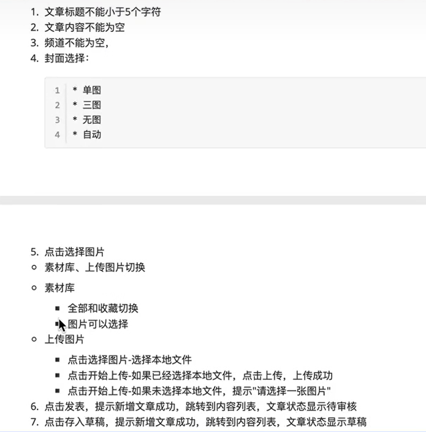

完成黑马头条web登录功能测试和完成黑马头条web发布文章功能测试
## 一：登录部分
#### 需求分析
登录需求-1
1.输入正确的中国手机号(11位)
	当文本框失去焦点（输入光标）的时候验证，红色为失败，绿色为成功
2.点击发送验证码
	如果手机号文本框状态为绿色，弹出“点击按钮进行验证”；
	如果手机号文本框为红色，提示手机号不正确
3.点击按钮进行验证
	拖拽图形到指定位置，按钮消失;
	拖拽图形未到指定位置，晃动提醒，滑块回到初始位置;
	超过5次，提示尝试过多，请点击重试;
登录需求-2
1.输入验证码
	正确的验证码，并“勾选我已阅读并同意”，点击登录，进入系统;
	错误的验证码，并“勾选我已阅读并同意”，，点击登录，提示验证码错误;
	正确的验证码，未“勾选我已阅读并同意”，，点击登录，提示请勾选;

#### 登录测试点提取

#### 测试用例
1. 正向：一次尽量覆盖多条
2. 逆向：一次之恩那个覆盖一条，其他都为正确
3. 为什么手机号为空还要输入正确的验证码，如何实现？
因为要验证的是后台不是js页面（不是单纯的红色绿色）；可以先输入正确手机号获取验证码，然后把手机号删除置空。
4. 单功能点（每个写一条）
	1. ui原型测试
		- 布局、颜色与原型一致
		- 图片与文字准确无误
	2. 兼容性（测最新版本就可以）
		- 火狐
		- 谷歌
		- ie
		- Edge
		- 苹果

| 用例编号      | 用例标题              | 项目/模块 | 优先级 | 前置条件                           | 测试步骤                           | 测试数据                               | 预期结果                               | 实际结果 |
| --------- | ----------------- | ----- | --- | ------------------------------ | ------------------------------ | ---------------------------------- | ---------------------------------- | ---- |
| login_001 | 登陆成功              | 登录    | p0  | 1.账号注册成功2.打开登陆界面               | 1.输入正确手机号2.输入正确验证码3.勾选协议4.点击登录 | 1.手机号：13012345678 2.验证码：246811  | 登陆成功，跳转个人主页 1.手机号和验证码的状态都为绿色    |      |
| login_002 | 登陆失败（手机号为空）       | 登录    | p1  | 1.账号注册成功2.打开登陆界面               | 1.输入正确手机号2.输入正确验证码3.勾选协议4.点击登录 | 1.手机号：空 2.验证码：246811            | 登陆失败。 手机号登录框状态提示红色，提示信息手机号不能为空。 |      |
| login_003 | 登陆失败（10位纯数字）      | 登录    | p1  | 1.账号注册成功2.打开登陆界面               | 1.输入手机号2.发送验证码                 | 1.手机号：1301234567                | 登陆失败，验证码发送失败，提示手机号格式不正确            |      |
| login_004 | 登陆失败（12位纯数字）      | 登录    | p1  | 1.账号注册成功2.打开登陆界面               | 1.输入手机号2.发送验证码                 | 1.手机号：130456789111 2.验证码：246811 | 登陆失败，验证码发送失败，提示手机号格式不正确            |      |
| login_005 | 登陆失败（11位纯数字，非手机段） | 登录    | p1  | 1.账号注册成功2.打开登陆界面               | 1.输入正确手机号2.发送验证码               | 1.手机号：01234567891 2.验证码：246811  | 登陆失败，验证码发送失败，提示手机号格式不正确            |      |
| login_006 | 登陆失败（手机号为非11位数字）  | 登录    | p1  | 1.账号注册成功2.打开登陆界面               | 1.输入正确手机号2.发送验证码               | 1.手机号：1301234567a 2.验证码：246811  | 登陆失败，验证码发送失败，提示手机号格式不正确            |      |
| login_007 | 登陆失败（手机号为注册）      | 登录    | p1  | 1.账号未注册2.打开登陆界面                | 1.输入正确手机号2.发送验证码               | 1.手机号：13012345678 2.验证码：246811  | 登陆失败，提示手机号未注册                      |      |
| login_008 | 登陆失败（验证码为空）       | 登录    | p1  | 1.账号注册成功2.打开登陆界面               | 1.输入正确手机号2.输入验证码3.勾选协议4.点击登录   | 1.手机号：13012345678 2.验证码：空       | 登录失败，提示验证码不能为空，验证码状态位红色            |      |
| login_009 | 登陆失败（验证码错误）       | 登录    | p1  | 1.账号注册成功2.打开登陆界面               | 1.输入正确手机号2.输入验证码3.勾选协议4.点击登录   | 1.手机号：13012345678 2.验证码：246     | 登陆失败，提示验证码不正确                      |      |
| login_010 | 登陆失败（验证码过期）       | 登录    | p1  | 1.账号注册成功2.打开登陆界面3.已获取验证码超过规定时间 | 1.输入正确手机号2.输入正确验证码3.勾选协议4.点击登录 | 1.手机号：13012345678 2.验证码：246811  | 登陆失败，提示验证码已过期，请刷新                  |      |
| login_011 | 登陆失败（协议未勾选）       | 登录    | p1  | 1.账号注册成功2.打开登陆界面               | 1.输入正确手机号2.输入正确验证码3.点击登录       | 1.手机号：13012345678 2.验证码：246811  | 登陆失败，提示请勾选协议                       |      |
| login_012 | 验证码验证功能（发送成功）     | 登录    | p1  | 1.账号注册成功2.打开登陆界面               | 1.点击获取验证码按钮2.滑动滑块到空缺位置         | 1.手机号：13012345678                  | 验证码发送成功                            |      |
| login_013 | 验证码验证功能（发送失败）     | 登录    | p1  | 1.账号注册成功2.打开登陆界面               | 1.点击获取验证码按钮2.滑动滑块到非空缺位置        | 1.手机号：13012345678               | 验证码发送失败，验证码窗口抖动                    |      |
| login_014 | 验证码验证功能（发送失败）     | 登录    | p1  | 1.账号注册成功2.打开登陆界面               | 1.点击获取验证码按钮2.滑动滑块到非空缺位置超过5次    | 1.手机号：13012345678                  | 验证码发送失败，弹窗消失提示尝试次数过多，请重试           |      |
## 二.发布文章

#### 发布测试点提取

| 用例编号        | 用例标题             | 项目/模块 | 优先级 | 前置条件                                 | 测试步骤                               | 测试数据                                           | 预期结果                         | 实际结果 |
| ----------- | ---------------- | ----- | --- | ------------------------------------ | ---------------------------------- | ---------------------------------------------- | ---------------------------- | ---- |
| publish_001 | 发表文章成功（单图）       | 发表文章  | p0  | 1.登陆成功2.点击发布文章                       | 1.输入标题2.输入内容3.选择封面4.选择频道5.点击发表     | 1.标题：哈哈哈11 2.内容：嘻 3.选择封面：单图  4.频道：ios | 文字发布成功，提示：文章发布成功，自动跳转至内容列表页面 |      |
| publish_002 | 保存文章到草稿箱成功（三图）   | 发表文章  | p0  | 1.登陆成功2.点击保存到草稿箱                     | 1.输入标题2.输入内容3.选择封面4.选择频道5.点击保存到草稿箱 | 1.标题：哈哈哈11 2.内容：嘻嘻 3.选择封面：三图 4.频道：ios    | 文字保存成功，提示：文字保存到草稿箱           |      |
| publish_003 | 发表文章成功（无图）       | 发表文章  | p0  | 1.登陆成功2.点击发布文章                       | 1.输入标题2.输入内容3.选择封面4.选择频道5.点击发表     | 1.标题：哈哈哈11 2.内容：嘻 3.选择封面：无图 4.频道：ios     | 文字发布成功，提示：文章发布成功，自动跳转至内容列表页面 |      |
| publish_004 | 发表文章成功（自动）       | 发表文章  | p0  | 1.登陆成功2.点击发布文章                       | 1.输入标题2.输入内容3.选择封面4.选择频道5.点击发表     | 1.标题：哈哈哈11 2.内容：嘻 3.选择封面：自动 4.频道：ios     | 文字发布成功，提示：文章发布成功，自动跳转至内容列表页面 |      |
| publish_005 | 发表文字失败（标题4个字符）   | 发表文章  | p1  | 1.登陆成功2.点击发布文章                       | 1.输入标题2.输入内容3.选择封面4.选择频道5.点击发表     | 1.标题：哈哈哈1 2.内容：嘻 3.选择封面：自动 4.频道：ios      | 文字发布失败，提示：标题最少5个字符           |      |
| publish_006 | 发表文字失败（标题为空）     | 发表文章  | p1  | 1.登陆成功2.点击发布文章                       | 1.输入标题2.输入内容3.选择封面4.选择频道5.点击发表     | 1.标题：“” 2.内容：嘻 3.选择封面：自动 4.频道：ios        | 文字发布失败，提示：标题最少5个字符           |      |
| publish_007 | 发表文字失败（内容为空）     | 发表文章  | p1  | 1.登陆成功2.点击发布文章                       | 1.输入标题2.输入内容3.选择封面4.选择频道5.点击发表     | 1.标题：哈哈哈1 2.内容：“” 3.选择封面：自动 4.频道：ios     | 文字发布失败，提示：内容不能为空             |      |
| publish_008 | 发表文字失败（封面单张未选择图） | 发表文章  | p1  | 1.登陆成功2.点击发布文章                       | 1.输入标题2.输入内容3.选择封面4.选择频道5.点击发表     | 1.标题：哈哈哈1 2.内容：嘻嘻3.选择封面：单张未选择 4.频道：ios   | 文字发布失败，提示：请上传封面图片            |      |
| publish_009 | 发表文字失败（封面三种无选择图） | 发表文章  | p1  | 1.登陆成功2.点击发布文章                       | 1.输入标题2.输入内容3.选择封面4.选择频道5.点击发表     | 1.标题：哈哈哈1 2.内容：嘻嘻3.选择封面：三张都未上传 4.频道：ios  | 文字发布失败，提示：请上传封面图片            |      |
| publish_010 | 发表文字失败（频道为空）     | 发表文章  | p1  | 1.登陆成功2.点击发布文章                       | 1.输入标题2.输入内容3.选择封面4.选择频道5.点击发表     | 1.标题：哈哈哈1 2.内容：嘻嘻3.选择封面：自动 4.频道：“”       | 文字发布失败，提示：频道不能为空             |      |
| publish_011 | ui布局测试（布局、颜色）    | 发表文章  | p1  | 1.登陆成功2.点击发布文章，打开文章发布页面3.打开原型图、ui布局图 | 1.对比文章页面与原型ui布局一致 2.页面与ui设计颜色一致 | 1.发布文章的ui图 2.发布文章的原型图 3.发布文章的页面          | 1.布局与产品原型一致 2.页面颜色与原型颜色一致 |      |
| publish_012 | ui布局测试（图片、文字）    | 发表文章  | p1  | 1.登陆成功2.点击发布文章，打开文章发布页面3.打开原型图、ui布局图 | 1.对比文章页面与原型ui布局一致 2.页面无错别字      | 1.发布文章的ui图 2.发布文章的原型图 3.发布文章的页面          | 1.图片与产品原型一致 2.页面无错别字      |      |

ui测试操作步骤必须是动作对于预期结果

测试流程：
1. 需求分析
2. 测试计划
3. 设计用例（1.设计测试点 2.编写用例覆盖测试点）
4. 执行用例
5. 缺陷管理（提交-->验证-->关闭）
6. 测试报告

缺陷管理：
1. 提交缺陷
2. 开发修复
3. 测试验证
4. 测试管理
工具：禅道，jira，Excel
缺陷组成：缺陷编号，缺陷标题（步骤＋预期＋实际），模块，严重级别，复现步骤，缺陷类型

---
测试报告：
1. 项目背景
2. 测试目标
3. 提测标准
4. 结束标准（上线标准）
5. 风险控制
6. bug统计
7. bug分析
8. 测试总结
